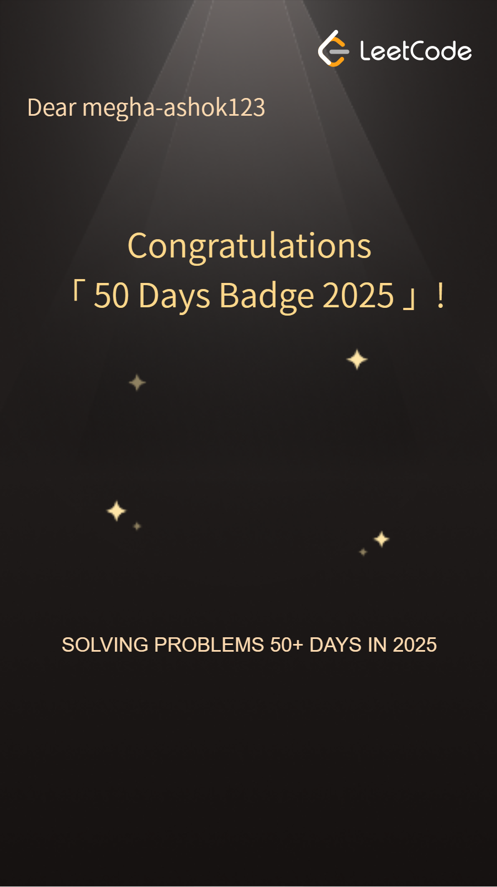
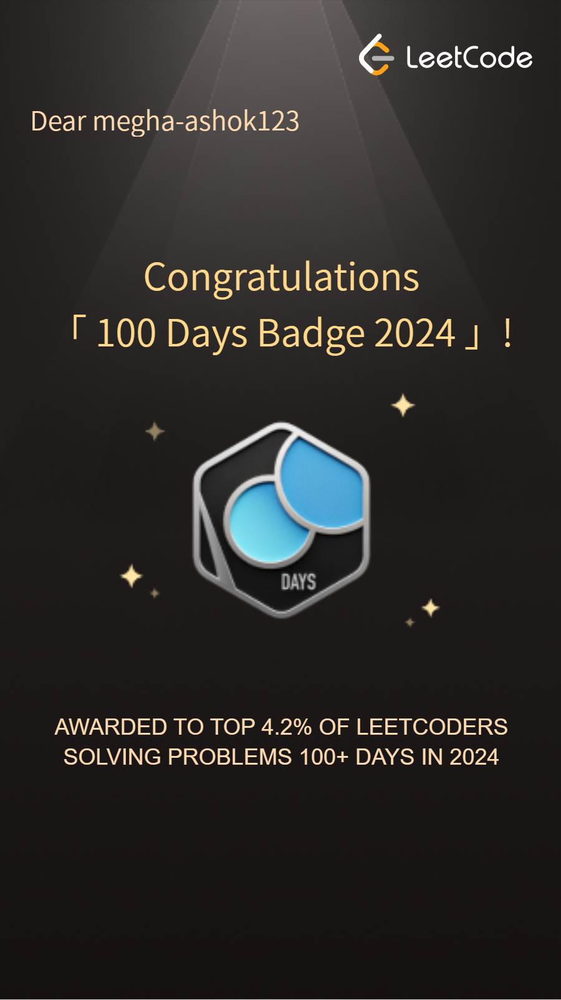
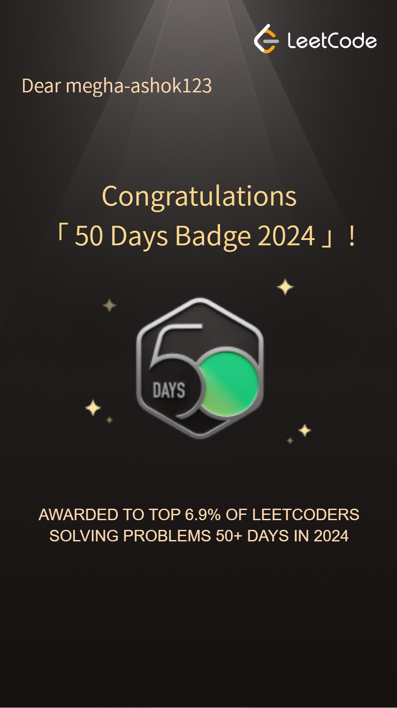

<h1 align="center">Hi 👋, I'm Megha Ashok Rabagannavar</h1>
<h3 align="center">A passionate Computer Science Student & Aspiring Software Engineer from India 🇮🇳</h3>

  

- 🌱 I’m currently learning **Generative AI, MLflow, and System Design**

- 👨‍💻 I’m currently working on **Student Performance Predictor**, **AgriSmart**, and **Vehicle Insurance**

- 📁 Check out my resume here - [My Resume](https://docs.google.com/document/d/1fOt-NmNURLhTna0-SpjROrO0AkK8cI7PruYawWnbkAw/edit?tab=t.0)

- 🖥️ All of my projects are available on [GitHub](https://github.com/Megha-Ashok)

- 🎥 I enjoy explaining concepts and have conducted peer learning sessions in programming and DSA

- 💬 Ask me about **Machine Learning, MLOps, Python, DSA, and Problem Solving**

- 📧 Reach out to me at **megharashokashok@gmail.com**

<h3 align="left">GitHub Stats:</h3>

&nbsp;

<h3 align="left">Languages and Tools:</h3>

  
  
  
  
  
  
  
  
  
  
  
  
  
  
  
  

<h3 align="left">Support:</h3>

  
